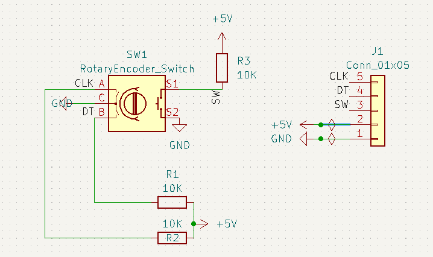

# Rotary Encoder Board

This a printed circuit board (PCB) designed to make a rotary encoder to prototype.

This was created using KiCad.

See https://github.com/Thomas1B/Arduino-Stuff/tree/main/Rotary_Encoder_tester for Arduino Code.

## Circuit Diagram

